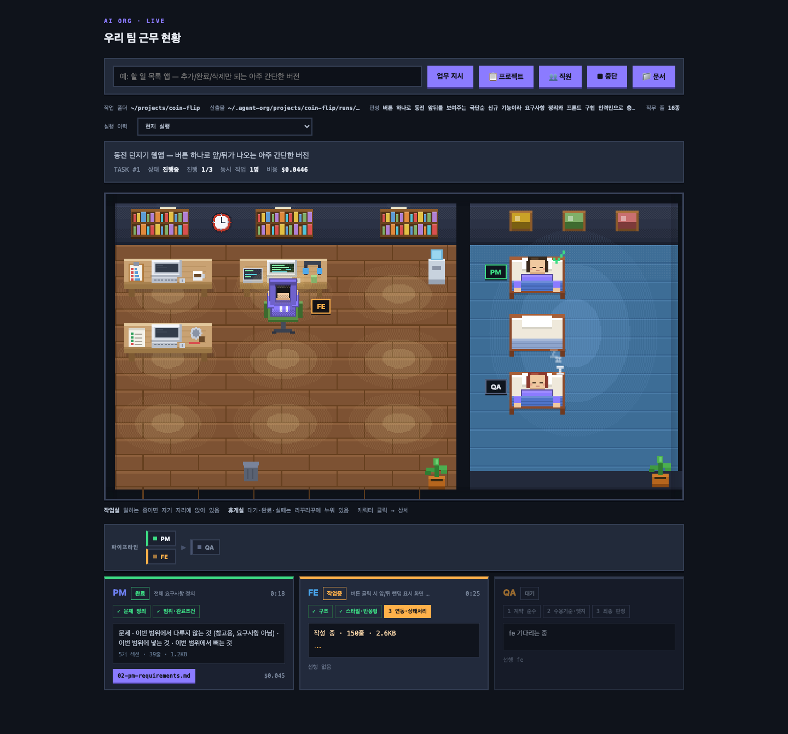
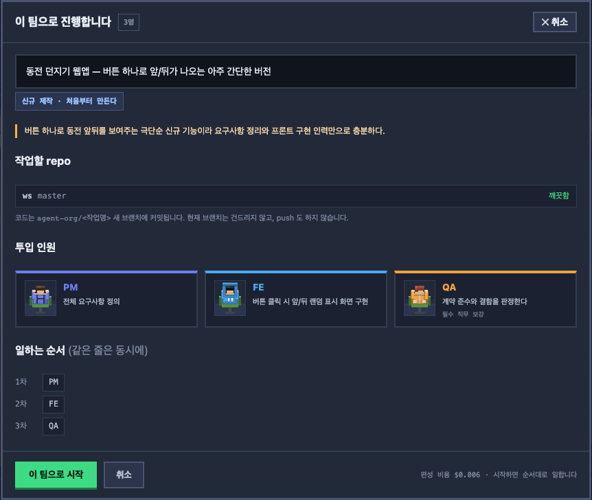

# agent-org

요구사항 한 줄을 던지면 **AI 개발팀이 알아서 팀을 꾸려** 작업하고, 결과를 git 브랜치에 커밋한다.
로컬에서만 돈다. 이미 굴러가던 프로젝트에 투입해도 된다.

```bash
cd ~/my-project
agent-org            # → http://localhost:4747
```



작업실 책상에 앉아 있으면 일하는 중, 휴게실 침대에 누워 있으면 대기·완료다. 아래 카드에서 각자 진행 단계와 산출물을 본다.



업무를 지시하면 요구사항 크기에 맞춰 필요한 사람만 뽑고, 일하는 순서를 보여준 뒤 시작한다.

소스 구조와 동작 원리는 [`docs/how-it-works.html`](docs/how-it-works.html) 을 브라우저로 열면 된다.

---

## 설치

```bash
git clone <repo> && cd agent-org
npm install
npm link                                          # agent-org 명령 등록
echo 'CLAUDE_CODE_OAUTH_TOKEN=sk-ant-oat01-...' > .env
chmod 600 .env
```

토큰은 `claude setup-token` 으로 발급한다. `.env` 는 git 에 올라가지 않는다.
실행한 폴더의 `.env` 를 먼저 읽고, 없으면 설치 폴더의 `.env` 를 쓴다.

## 사용법

```bash
agent-org                      # 현재 폴더를 작업 공간으로 대시보드 실행
agent-org ./my-project         # 폴더 지정
agent-org --port 5055          # 포트 고정 (미지정 시 막혀 있으면 다음 포트로 이동)
agent-org --budget 5           # 작업 1건당 비용 상한 (기본 $10, 0=무제한)
agent-org --rework 2           # QA FAIL 시 재작업 횟수 (기본 1)
agent-org --no-review          # 상호 검토 끄기 (싸고 빠르지만 독단 위험)
agent-org --run "할 일 앱"      # 대시보드 없이 CLI 로 1회 실행
```

**프로젝트 관리**

```bash
agent-org projects             # 등록된 프로젝트 목록
agent-org rename <구> <신>      # 이름 변경
agent-org forget <이름>         # 목록에서 제거 (문서는 남김)
```

**브랜치 정리**

```bash
agent-org branches             # 이 도구가 만든 브랜치 목록 (머지 여부 표시)
agent-org merge <브랜치>        # 기본 브랜치에 머지
agent-org cleanup              # 머지된 브랜치만 삭제
agent-org cleanup --force      # 미머지 포함 삭제 (작업이 사라집니다)
```

---

## 어떻게 도는가

```
일감 투입
  ↓
① 기존 코드가 있으면 먼저 파악 (읽기 전용) + git 내력 추출
  ↓
② 일감 성격 판단 (신규 / 기능추가 / 버그수정 / 리팩터링 / 잡일)
  ↓
③ 필요한 직무를 필요한 인원만큼 고용 → 착수 브리핑으로 확인
  ↓
④ 선행이 끝난 사람부터 동시에 작업
     · 중요 산출물은 관련자 상호 검토 → 보완
     · 아키텍트/리드가 기술 스택 확정 → 구현자가 그대로 따름
  ↓
⑤ QA 판정 → FAIL 이면 구현자 재작업 → 재검토
  ↓
⑥ PM 이 실측 데이터로 병목 점검
  ↓
⑦ 코드는 repo 새 브랜치에 커밋 / 문서는 ~/.agent-org 에 누적
```

### 팀은 고정되어 있지 않다

16개 직무 중 **그 일에 필요한 사람만** 뽑는다.

| 분류 | 직무 |
|---|---|
| 경영 | 사장, PM\*, 기획자 |
| 디자인 | UX리서처, 디자이너 |
| 설계 | 개발리드, 아키텍트 |
| 구현 | FE†, BE†, 모바일†, 데이터†, ML†, DevOps |
| 품질 | 보안, QA\* |
| 문서 | 테크라이터 |

`*` 항상 고용 · `†` 일이 크면 여러 명

```
"버튼 누르면 숫자 세는 웹 카운터"   → 3명 (PM, FE, QA)
"재고관리 — 입출고·조회 API·관리자 화면·리포트"
                                → 7명 (BE 2명이 범위를 나눠 병렬)
```

빠진 자리는 자동으로 채운다. 만들 사람이 아무도 없으면 FE 를 넣고, 구현 인원이 둘 이상이면
계약을 정할 개발리드를 넣는다. 다만 버그 하나 고치는 데 사장까지 부르지는 않는다.

### 기술 스택은 사람이 정한다

파일명이 코드에 박혀 있지 않다. **아키텍트가 있으면 아키텍트가, 없으면 개발리드가**
요구사항 규모를 보고 정하고, 그 결정이 구현자들의 파일명과 언어를 바꾼다.

```
React 선택   → 06-fe-App.tsx        FastAPI → 09-be-main.py
바닐라 선택  → 06-fe-index.html     Express → 09-be-server.js
```

기존 프로젝트면 **온보딩이 알아낸 기존 위치**(`src/server.js`)를 그대로 이어받는다.

### 아무도 혼자 확정하지 않는다

개발리드가 계약을 혼자 정하고 구현자들이 그대로 따르면, 리드가 틀렸을 때 팀 전체가 틀린다.
그래서 판단이 아래로 전파되는 산출물은 **관련자 승인**을 받아야 넘어간다.

| 작성자 | 검토자 | 검토 관점 |
|---|---|---|
| 기획자 | PM | 요구사항·완료조건을 벗어나거나 빠뜨렸는가 |
| 디자이너 | 기획자 | 유저 스토리와 수용 기준이 반영됐는가 |
| 아키텍트 | PM, 개발리드 | 되돌리기 어려운 결정이 섞이지 않았는가 |
| 개발리드 | PM, 기획자 | 구현자들이 이 문서만으로 일할 수 있는가 |

검토자는 **자기 직무의 눈으로만** 본다. PM 이 코드 스타일을 지적하거나 기획자가 인덱스를
논하면 검토가 아니라 참견이다. 취향 문제로 반려할 수 없다.

`검토: 보완요청` 이 하나라도 나오면 작성자가 다시 쓴다 (1회). 동의하지 않으면 이유와
대안을 문서에 남길 수 있다.

### 일감 성격에 따라 팀이 달라진다

| 성격 | 누가 | 어떻게 |
|---|---|---|
| 신규 | 풀팀 | 처음부터 만든다 |
| 기능 추가 | PM·리드·구현·QA | 기존 동작을 깨지 않는 게 우선 |
| 버그 수정 | 구현 + QA | 재현 경로 먼저, 원인만 최소로 |
| 리팩터링 | 리드·구현·QA | 겉보기 동작 유지 확인이 핵심 |
| 잡일 | 최소 | 코드 동작은 안 건드림 |

기존 코드를 건드린 작업이면 **QA 에 회귀 점검 단계가 붙는다** — 기존 API 형식이 그대로인지,
자주 깨지던 파일을 건드렸는지, 기존 관례를 어겼는지 대조한다.

---

## 이미 굴러가던 프로젝트에 투입할 때

빈 폴더가 아니면 팀을 꾸리기 전에 **먼저 파악**한다.

| 무엇을 | 어떻게 | 비용 |
|---|---|---|
| 코드 구조·스택·관례·기존 API | 읽기 전용(Read/Glob/Grep)으로 훑음 | 약 $0.3 |
| 프로젝트 내력 | git 에서 직접 추출 (모델 안 씀) | 0 |

`knowledge/CODEBASE.md` — 구조·진입점·기존 API·관례·건드리면 위험한 곳
`knowledge/HISTORY.md` — 커밋 관례·자주 바뀌는 파일·최근 방향·기여자·태그

repo HEAD 를 지문으로 저장해 두고 **코드가 바뀐 경우에만** 다시 파악한다.
대시보드에서 파악이 필요하면 프로젝트 버튼에 표시가 뜨고, 눌러서 바로 실행할 수 있다.

---

## 결과물은 어디에 쌓이나

**코드와 문서의 주인이 다르다.**

```
<타겟 repo>/                      ← repo 의 것
└── agent-org/<날짜-작업명> 브랜치에 코드만
    (현재 브랜치는 안 건드림 · push 안 함 · 문서로 오염되지 않음)

~/.agent-org/                     ← 도구의 것
├── index.md                      전체 프로젝트 한 장
└── projects/my-service/
    ├── README.md                 이 프로젝트 요약
    ├── knowledge/                지금 상태 (사람이 볼 것)
    │   ├── CODEBASE.md           코드 구조·관례
    │   ├── HISTORY.md            git 내력
    │   ├── CONTRACTS.md          누적된 인터페이스 계약
    │   ├── BACKLOG.md            미룬 일
    │   ├── track-record.md       팀 성적표
    │   └── qa-findings.md        QA 지적 누적
    ├── runs/
    │   ├── index.md              실행 목록
    │   ├── <날짜-일감>/           설계 문서 + 어느 커밋인지
    │   └── _archive/             최근 20건 넘으면 자동 이동
    └── .state/                   DB
```

작업 폴더에 repo 가 여러 개면 계약이 repo 경계를 넘는다. 그런 문서를 어느 한 repo 안에
두면 반쪽이 되므로 중앙에 둔다. **`runs/` 에 코드 사본을 두지 않는다** — 커밋 해시와
변경 파일 목록만 남긴다. 코드의 진실은 repo 에 하나만 있다.

### 프로젝트 식별

**작업 폴더 경로**가 기준이다. repo 가 겹친다고 같은 프로젝트로 합치지 않는다.
공유 라이브러리를 여러 프로젝트가 함께 쓰는 일이 흔한데, 그걸 근거로 합치면 서로 다른
프로젝트의 계약과 결정이 한 문서에 섞인다. 같은 repo 를 쓰는 프로젝트는 **관계로만** 기록한다.

---

## 쌓이는 것들

### 계약

첫 작업에서 정한 응답 형식이나 에러 코드는 두 번째 작업에서도 지켜져야 한다.
리드가 계약을 낼 때마다 `CONTRACTS.md` 에 **덧붙인다**. 나중 항목이 앞 항목을 덮어쓰지
않으므로, 충돌이 보이면 그 자체가 검토 대상이 된다.

다음 실행의 리드는 이 문서를 받아 시작한다. 전문을 다 넣으면 프롬프트가 터지므로
**확정된 엔드포인트 목록 + 가장 최근 계약**만 싣는다.

```
실행 20건 · 문서 13.6KB  →  리드에게 가는 요약 1.2KB (엔드포인트 21개 전부 유지)
```

### 남은 일

기획자의 "범위 밖 항목", 리드의 "확장 지점", QA 의 "비차단 사항", PM 의 "다음에 바꿀 것" 을
`BACKLOG.md` 한 곳에 모은다. 같은 항목은 중복으로 쌓지 않는다.

다음 실행의 PM·기획자가 이 목록을 받아 이번 범위에 넣을지 판단한다. 구현자에게는 주지
않는다 — 범위만 흔들린다. 체크박스는 직접 고쳐도 된다.

---

## 안전장치

코드를 쓰기 전 점검에서 하나라도 걸리면 **코드를 쓰지 않는다.**

- 커밋 안 된 변경이 있음 → 남의 작업을 덮을 수 있으므로 중단
- git 저장소가 아님 / 커밋이 하나도 없음
- repo 밖으로 나가는 경로

브랜치 삭제도 여러 겹으로 막는다.

| 상황 | 동작 |
|---|---|
| `agent-org/` 로 시작하지 않는 브랜치 | 거부 — 사람이 만든 것은 안 건드린다 |
| `main` / `master` | 거부 |
| 지금 체크아웃된 브랜치 | 거부 |
| 머지 안 된 브랜치 | 기본은 남김. `--force` 를 명시해야 삭제 |
| 머지 충돌 | `merge --abort` 후 원래 브랜치로 복귀 |

글 쓰는 역할에는 **도구를 주지 않는다.** 코드를 읽는 건 온보딩 단계뿐이고, 그때도
읽기 전용 + 작업 폴더 안으로 제한한다.

비용은 `--budget` 으로 막는다. 초과하면 새 역할을 시작하지 않고 중단한다.
대시보드의 `■ 중단` 으로 진행 중인 작업을 멈출 수 있다 — 진행 중인 단계가 끝나는
지점에서 정지하므로 이미 지불한 응답을 버리지 않는다.

---

## 대시보드

| 버튼 | 내용 |
|---|---|
| 업무 지시 | 팀을 꾸려 **착수 브리핑**을 띄운다 (인원·범위·순서·대상 repo 확인 후 시작) |
| 📋 프로젝트 | 이 프로젝트가 뭔지 한 화면 · 파악 안 됐으면 여기서 실행 |
| 👥 직원 | 16개 직무 명부 · 픽셀 초상 · **시스템 프롬프트 전문** · 단계별 프롬프트 |
| ■ 중단 | 진행 중인 작업 정지 |
| 📁 문서 | `~/.agent-org` 문서 트리 + 마크다운 뷰어 |

화면 위쪽은 **픽셀 사무실** 이다. 일하는 사람은 자기 책상에 앉아 있고, 대기·완료는
휴게실 라꾸라꾸에 누워 있다. 아래 카드에는 단계 진행·산출물 요약·소요·비용이 뜬다.
아무거나 클릭하면 상세 모달이 열린다.

---

## 비용

역할당 2~3단계씩 도니 간단한 앱 1건에 **$3~6** 정도. 재작업·검토가 붙으면 늘어난다.

```bash
agent-org --budget 3           # 상한
agent-org --no-review          # 검토 생략
agent-org --rework 0           # 재작업 생략
```

같은 내용을 단계마다 다시 보내지 않도록, 배경 문서는 첫 단계와 회귀 점검에만 싣고
선행 산출물과 누적 문서에는 크기 상한을 둔다.

---

## 파일 구조

```
agent-org/
├── README.md, package.json, .gitignore   설정과 문서만
├── bin/agent-org.mjs                     CLI 진입점
├── src/                                  모든 로직
├── public/                               대시보드 (빌드 없음)
└── docs/how-it-works.html                동작 원리 설명
```

| 파일 | 역할 |
|---|---|
| `src/roles.mjs` | **조직의 단일 진실.** 직무·의존·단계·프롬프트 정의 |
| `src/staffing.mjs` | 일감을 보고 팀을 꾸린다 (성격 판단 포함) |
| `src/stack.mjs` | 기술 스택 결정을 읽어 파일명으로 바꾼다 |
| `src/onboarding.mjs` | 기존 코드 파악 (읽기 전용) |
| `src/history.mjs` | git 내력 추출 (모델 안 씀) |
| `src/pipeline.mjs` | 실행 엔진 — 병렬 스케줄·검토·재작업·예산 |
| `src/contracts.mjs` | 계약 누적 |
| `src/backlog.mjs` | 미룬 일 누적 |
| `src/git.mjs` | 브랜치·커밋·정리 (안전장치) |
| `src/projects.mjs` | 프로젝트 식별·등록 |
| `src/docs.mjs` | 문서 자동 생성 |
| `src/db.mjs` | SQLite 스키마 |
| `src/server.mjs` | HTTP + SSE + API |
| `public/dashboard.html` | 대시보드 화면과 앱 로직 |
| `public/pixel.js` | 픽셀 아트 그리기 함수 |
| `public/dashboard.css` | 대시보드 스타일 |

직무를 추가하려면 `src/roles.mjs` 에 항목을 넣으면 된다. 문서·대시보드·파이프라인이 알아서 따라간다.
